# GameStock — Sistema de Gestión para Tienda de Videojuegos Físicos

## 1. Descripción del dominio del problema

**GameStock** es un sistema de gestión pensado para una tienda física de videojuegos que vende títulos para distintas plataformas (PlayStation, Xbox, Nintendo Switch, PC), tanto nuevos como usados.

### Problema que busca resolver

En un local de este tipo, el mostrador necesita respuestas rápidas todo el tiempo: *"¿tenemos este juego en stock?"*, *"¿a qué precio lo vendimos la última vez?"*, *"¿qué compró este cliente antes?"*. Un modelo relacional tradicional obligaría a separar productos, plataformas, clientes y el detalle de cada venta en tablas distintas, requiriendo varios `JOIN`s solo para mostrar un ticket de venta completo. Esto es lento e innecesariamente complejo para un negocio donde:

- El catálogo de productos cambia constantemente (nuevos ingresos, bajas de stock).
- Cada venta puede incluir varios juegos distintos, y ese detalle se necesita completo y de forma inmediata (por ejemplo, para imprimir el ticket o consultar el historial de un cliente).

### Rol de la base de datos

Se utilizará **MongoDB**, una base de datos NoSQL orientada a documentos, priorizando cómo la aplicación va a **consumir** los datos por sobre la normalización estricta. Esto permite:

1. Consultar el detalle completo de una venta (con todos los productos incluidos) en una sola lectura.
2. Mantener el catálogo de plataformas y clientes centralizado, evitando datos duplicados o desactualizados.
3. Adaptar el esquema de un producto sin necesidad de migrar toda una tabla (por ejemplo, agregar un campo nuevo solo para juegos coleccionables).

---

## 2. Modelado conceptual orientado a documentos

### Entidades principales

- **Plataformas** (PS5, Xbox Series, Nintendo Switch, PC, etc.)
- **Productos** (los juegos físicos en stock)
- **Clientes**
- **Ventas** (con el detalle de productos vendidos)

### Colecciones propuestas

#### 2.1 `plataformas`

```json
{
  "_id": "ObjectId('65a1a...')",
  "nombre": "PlayStation 5",
  "fabricante": "Sony",
  "generacion": 9
}
```

#### 2.2 `productos`

```json
{
  "_id": "ObjectId('65a2b...')",
  "titulo": "God of War Ragnarök",
  "plataformaId": "ObjectId('65a1a...')",
  "genero": "Acción / Aventura",
  "clasificacion": "+18",
  "estado": "nuevo",
  "precio": 55000.00,
  "stock": 8,
  "codigoBarras": "7891234567890"
}
```

> `plataformaId` **referencia** al documento de `plataformas`, ya que muchos productos comparten la misma plataforma y su información (nombre, fabricante) no debe duplicarse en cada juego.

#### 2.3 `clientes`

```json
{
  "_id": "ObjectId('65a3c...')",
  "nombre": "Martín Suárez",
  "email": "martin.suarez@mail.com",
  "telefono": "261-555-1234",
  "fechaAlta": "2024-11-05T13:00:00Z"
}
```

#### 2.4 `ventas`

Se **referencia** `clienteId`, pero se **embebe** el detalle de los productos vendidos.

```json
{
  "_id": "ObjectId('65a4d...')",
  "clienteId": "ObjectId('65a3c...')",
  "fecha": "2025-06-12T18:45:00Z",
  "medioPago": "Tarjeta de débito",
  "items": [
    {
      "productoId": "ObjectId('65a2b...')",
      "titulo": "God of War Ragnarök",
      "cantidad": 1,
      "precioUnitario": 55000.00
    },
    {
      "productoId": "ObjectId('65a2c...')",
      "titulo": "Mario Kart 8 Deluxe",
      "cantidad": 2,
      "precioUnitario": 38000.00
    }
  ],
  "total": 131000.00
}
```

---

## 3. Fundamentación de la lógica no relacional

Las decisiones de anidar (embedded) o referenciar (references) se basaron en tres criterios: **frecuencia de acceso conjunto**, **reutilización del dato en múltiples documentos** y **frecuencia de actualización independiente**.

### 3.1 `plataformaId` referenciado en `productos`

- Una misma plataforma (por ejemplo, "PlayStation 5") está asociada a decenas o cientos de productos distintos. Si se embebiera la información de la plataforma dentro de cada producto, cualquier corrección (por ejemplo, un error de tipeo en el nombre) obligaría a actualizar **todos** los productos asociados, generando redundancia e inconsistencia. Por eso se referencia mediante `plataformaId`, manteniendo un único documento maestro por plataforma.

### 3.2 `clienteId` referenciado en `ventas`

- Un cliente puede realizar múltiples compras a lo largo del tiempo. Embeber sus datos completos (nombre, email, teléfono) dentro de cada venta duplicaría esa información en cada transacción y, si el cliente actualiza su teléfono, habría que modificar todas sus ventas históricas. Referenciarlo mediante `clienteId` mantiene un único registro actualizado y consistente.

### 3.3 Ítems de la venta embebidos en `ventas`

- El patrón de acceso más frecuente para una venta es leerla **completa**: al emitir un ticket, consultar el historial de compras de un cliente, o generar un reporte de ventas del día, siempre se necesita el detalle de **qué productos** se vendieron, en **qué cantidad** y a **qué precio en ese momento**.
- Este array es **acotado** (una venta tiene, en la práctica, un puñado de ítems, no miles), por lo que no hay riesgo de exceder el límite de tamaño de documento de MongoDB.
- Además, el precio y el título del producto se **congelan** dentro del ítem al momento de la venta (denormalización intencional). Esto es clave: si mañana el precio del juego cambia, la venta ya emitida no debe verse afectada — el ticket tiene que reflejar el precio real que pagó el cliente en su momento, no el precio actual del catálogo.
- Por estas razones, anidar los ítems dentro de la venta es la decisión correcta: optimiza la lectura completa del comprobante y preserva la integridad histórica de la transacción, algo que sería mucho más costoso de lograr con referencias.

### 3.4 Resumen de decisiones

| Relación | Estrategia | Motivo principal |
|---|---|---|
| Producto → Plataforma | Reference | Entidad reutilizada por muchos productos, evita redundancia |
| Venta → Cliente | Reference | Datos del cliente se actualizan de forma independiente |
| Venta → Ítems vendidos | Embedded | Se leen siempre juntos (ticket), array acotado, preserva el precio histórico |

---

## 4. Implementación y sembrado de datos (Fase 2)

### 4.1 Base de datos y colecciones

Se creó la base de datos **`gamestock`** en MongoDB, con las cuatro colecciones definidas en el modelado conceptual: `plataformas`, `productos`, `clientes` y `ventas`.

### 4.2 Dataset de prueba (seeding)

Los archivos de sembrado se encuentran en la carpeta [`/scripts`](./scripts):

- [`plataformas.json`](./scripts/plataformas.json) — 6 documentos.
- [`clientes.json`](./scripts/clientes.json) — 11 documentos.
- [`productos.json`](./scripts/productos.json) — 12 documentos.
- [`ventas.json`](./scripts/ventas.json) — 10 documentos.

Para importarlos en MongoDB (con la base ya creada), desde una terminal ubicada en la carpeta `/scripts`:

```bash
mongoimport --db gamestock --collection plataformas --file plataformas.json --jsonArray
mongoimport --db gamestock --collection clientes --file clientes.json --jsonArray
mongoimport --db gamestock --collection productos --file productos.json --jsonArray
mongoimport --db gamestock --collection ventas --file ventas.json --jsonArray
```

#### Variaciones estructurales (schema-less)

Para evidenciar la flexibilidad del esquema, se incluyeron documentos con variaciones justificadas por el negocio:

- **`productos`** — algunos juegos **usados** incluyen un subdocumento anidado `condicion` (`caja`, `manual`, `rayas`) que no existe en los juegos nuevos, ya que ese detalle solo aplica a productos de segunda mano.
- **`productos`** — algunas **ediciones especiales** incluyen los campos `edicionEspecial` y `contenidoEdicion` (un array de extras), ausentes en las ediciones estándar.
- **`ventas`** — solo algunas ventas incluyen el subdocumento `descuento` (cuando aplicó una promoción) o `envio` (cuando la compra se despachó a domicilio en vez de retirarse en el local), y el array `items` varía entre 1 y 4 elementos según la compra.

### 4.3 Consultas y actualizaciones (`/scripts/queries.js`)

El archivo [`queries.js`](./scripts/queries.js) contiene, comentada línea por línea, cada una de las consultas y operaciones detalladas en la sección 5.

---

## 5. Pruebas de consultas (MQL)

### 5.1 Consultas de lectura

**1. Filtrado básico por coincidencia exacta**

```javascript
db.productos.find({ estado: "usado" });
```
*Problema de negocio que resuelve:* permite al mostrador ver rápidamente todos los juegos usados en stock, para controlar su condición física o armar promociones de productos de segunda mano.

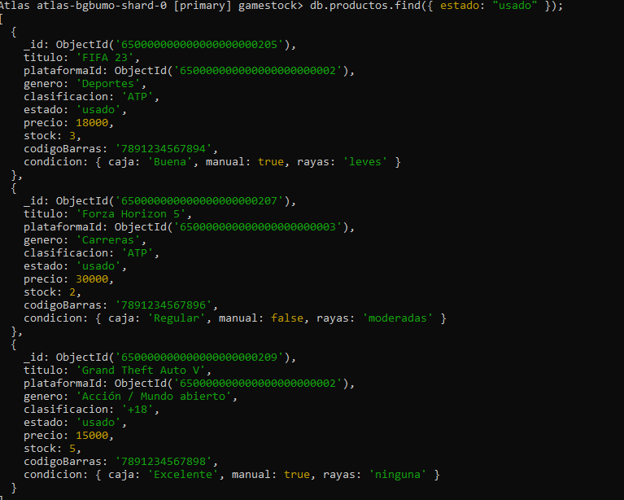

---

**2. Operadores de comparación (`$gte`, `$lte`, `$in`)**

```javascript
db.productos.find({
  precio: { $gte: 40000, $lte: 70000 },
  plataformaId: {
    $in: [
      ObjectId("650000000000000000000001"), // PS5
      ObjectId("650000000000000000000003")  // Xbox Series X
    ]
  }
});
```
*Problema de negocio que resuelve:* identifica productos "premium" (precio medio-alto) disponibles solo en consolas de última generación, útil para armar una sección de destacados en la vidriera.

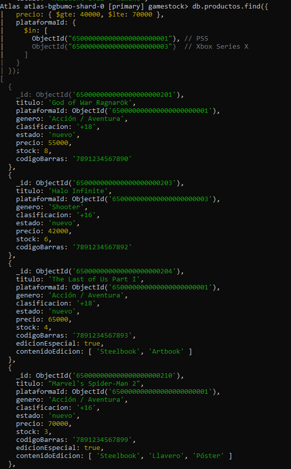
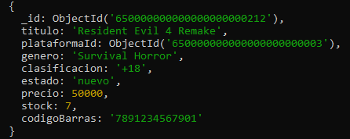

---

**3. Acceso a propiedades anidadas (dot notation)**

```javascript
db.productos.find({ "condicion.caja": "Buena" });
```
*Problema de negocio que resuelve:* dentro de los productos usados, filtra específicamente los que están en buen estado de caja, para asegurar calidad antes de ofrecerlos a un cliente.

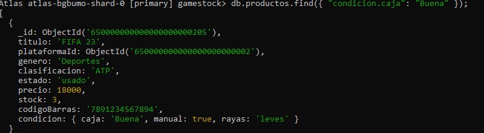

---

**4. Proyección de campos (excluyendo `_id`)**

```javascript
db.productos.find(
  { estado: "nuevo" },
  { titulo: 1, precio: 1, _id: 0 }
);
```
*Problema de negocio que resuelve:* genera un listado liviano de título + precio para mostrar en pantalla de catálogo, sin exponer campos internos como el `_id`.

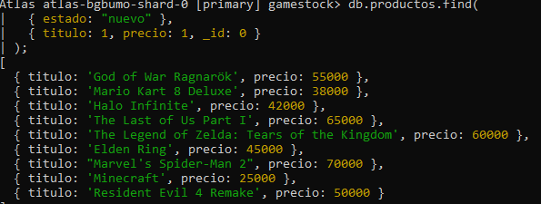

---

**5. Filtro de elementos dentro de un arreglo (`$elemMatch`)**

```javascript
db.ventas.find({
  items: { $elemMatch: { cantidad: { $gte: 2 } } }
});
```
*Problema de negocio que resuelve:* detecta ventas donde se compró más de una unidad del mismo producto en un solo ítem, lo que puede indicar compras mayoristas o de reventa.

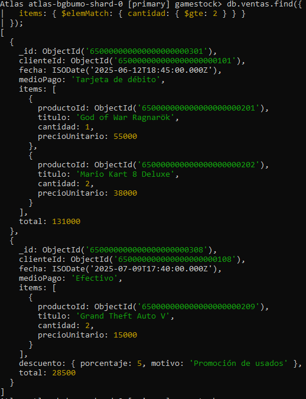

### 5.2 Actualizaciones y eliminación

**1. `$set` — modificar un campo y añadir una propiedad nueva**

```javascript
db.productos.updateOne(
  { _id: ObjectId("650000000000000000000210") },
  {
    $set: {
      enOferta: true,
      precioOferta: 63000.00
    }
  }
);
```
*Problema de negocio que resuelve:* pone en oferta un producto puntual (Marvel's Spider-Man 2), agregando un precio promocional sin perder el precio de lista original.

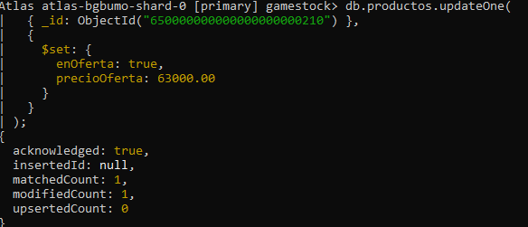

---

**2. `$inc` — incrementar/decrementar un contador**

```javascript
db.productos.updateOne(
  { _id: ObjectId("650000000000000000000201") },
  { $inc: { stock: -1 } }
);
```
*Problema de negocio que resuelve:* descuenta automáticamente una unidad de stock al concretarse una venta, de forma atómica (sin tener que leer y reescribir el valor manualmente).

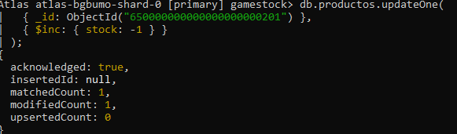

---

**3. `deleteOne` — eliminación segura con filtro estricto**

```javascript
db.clientes.deleteOne({ email: "email.eliminar@mail.com" });
```
*Problema de negocio que resuelve:* elimina una cuenta de cliente de prueba/duplicada que solicitó la baja, usando el email (campo único) como criterio estricto para evitar borrar más de un documento por error.

**Antes de eliminar** — la colección `clientes` con el registro de prueba (`email.eliminar@mail.com`) todavía presente:

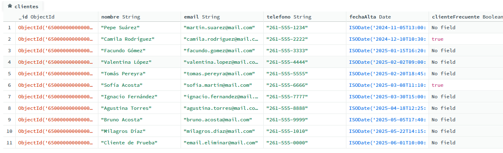

**Ejecución del `deleteOne`:**

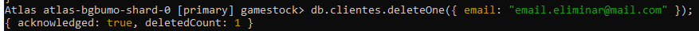

**Después de eliminar** — el registro de prueba ya no aparece en la colección:

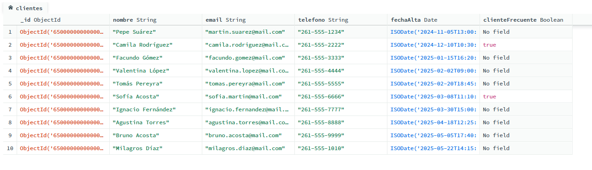
